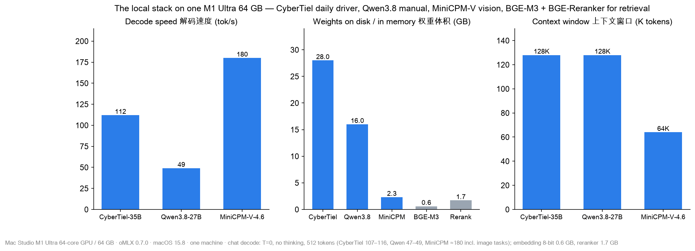
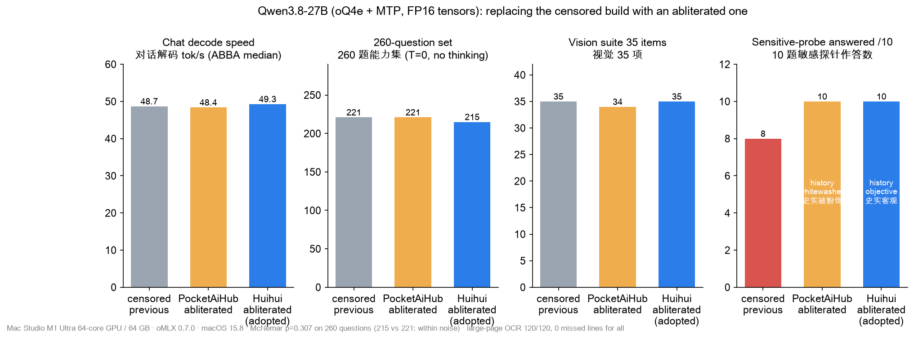
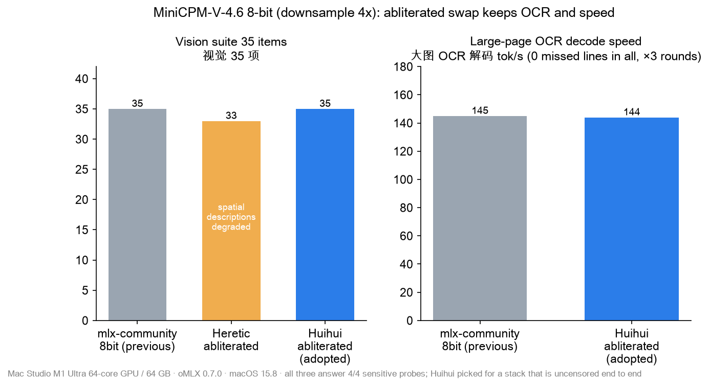

**English** | [简体中文](README.zh-CN.md)

# Tuning 5 local models on an M1 Ultra (64 GB) with oMLX 0.7.0 — measured notes

> Tested 2026-10-06 / 10-07 (10-07 additions: section 9 on code-model candidates, section 10 on hot cache and concurrency; 10-10: section 12 on the retrieval pair). Every number comes from one machine. Every adopted change was checked with
> ABBA runs in the same session and a fixed 260-question quality set. Community numbers are labelled.
>
> **Update 2026-10-07 evening:** the Qwen3.8 and MiniCPM-V builds were replaced with abliterated ones (no speed or capability loss) and all three daily models are now on the Hub with their exact settings — see section 11, `config/` and `recipes/`.
>
> **Update 2026-10-10:** the embedding model was replaced (Qwen3-Embedding-0.6B retired → **BGE-M3, 8-bit**) and the reranker was slimmed down losslessly; both are on the Hub now, together with a re-check of the whole stack — see section 12.

## TL;DR

| Model | Final setup | Measured effect |
|---|---|---|
| **CyberTiel-Coder-35B-A3B** (oQ6e MoE) | Non-quantized **BF16 tensors cast to FP16** offline + **adaptive MTP depth** | Prefill **+28–50 %** (16K: 1096 → 1644 tok/s); decode at 16K **+22 %**; short-chat decode +5 % (109–116 tok/s); quality 206/260 = 206/260 |
| **Qwen3.8-27B** (MTPLX Optimized-Speed FP16, 4-bit) | **`mtp_fixed_depth: 2`** | 47–48 tok/s, compared with 27.4 with MTP off (**+73 %**) and 44.3 with 0.7.0's default adaptive depth (**+7 %**) |
| **MiniCPM-V-4.6-8bit** | Kept as the dedicated vision model | Same OCR accuracy as the 27B, **3–4× faster**, **~1/9 of the memory** |
| **BGE-M3** (replaced Qwen3-Embedding-0.6B on 10-10) | **8-bit (gs64)**, context cap 2048, `embedding_batch_size` 16 — FP16 weights are *slower* on 0.7.0 | 612 MB (upstream 2.27 GB); single query 11.8 ms (FP32 13.1); cosine ≥ 0.999 vs FP32 (section 12) |
| **bge-reranker-v2-m3** | **FP16 embedding tables only** (lossless, 2.27 → 1.74 GB); **chunk long docs on the client** | Same latency as FP32 (+1.6 %); all-FP16 is +9.9 % slower with a large model resident; chunking lifts top-1 on long documents 0.23 → 0.50 (section 12) |

## Setup and method

**Hardware and software**
- Mac Studio M1 Ultra (64-core GPU), 64 GB, macOS 15.8.1.
- oMLX 0.7.0 (build 2987), MLX 0.32.2, mlx-lm 0.31.4.dev, mlx-vlm 0.7.1.

**Chat test**
- Three prompts: a long Chinese explanation, a Python module, and a math word problem.
- T=0, thinking off, 512 output tokens.
- A unique nonce in each prompt guarantees `cached_tokens=0`.
- Metric: the server-side `generation_tokens_per_second`, median of 9 requests.

**Built-in benchmark** (same method as the omlx.ai leaderboard)
- pp1K/4K/16K + tg128, with the `code_python` corpus.
- **Heads-up:** the built-in benchmark **uploads results to omlx.ai by default**. Passing `"align_prompt_to_ane": true` skips the upload. It turns PP4096 into PP4097, which is negligible.

**Quality gate**
- 260 fixed questions from oMLX's bundled eval data: MMLU 50, CMMLU 50, TruthfulQA 50, GSM8K 50, HumanEval 20, MBPP 30, LiveCodeBench 10.
- Generated code runs only inside `sandbox-exec`.

**Vision gate**
- A 35-item suite plus a 30-row document OCR (60 fields).
- All test images are synthetic.

## 1. After upgrading to 0.7.0, check your MTP fields

0.7.0 **deprecates `mtp_num_draft_tokens`**. Depth is now set with:
- `mtp_fixed_depth`: a fixed depth.
- `mtp_adaptive_max_depth`: a ceiling for adaptive depth. Leave both empty to get the model's default adaptive depth.

The old key is **ignored silently**. Our documented "d2 / d3" settings had not been applied since the upgrade.

## 2. Sweep the MTP depth per model


**MoE CyberTiel (3B active per token): adaptive depth wins.**

| Setting | tok/s |
|---|---:|
| MTP off | 59.4 |
| d1 | 69.5 |
| d2 | 89.8 |
| d3 | 84.7 |
| **adaptive (default)** | **94–95** |

**Dense Qwen3.8-27B: fixed d2 wins.**

| Setting | tok/s |
|---|---:|
| MTP off | 27.4 |
| d3 | 38.6 |
| d4 | 40.4 |
| adaptive | 44.3 |
| **fixed d2** | **47–48** |

On Qwen3.8-27B, verification costs more per cycle than on the MoE, so deeper drafts stop paying off sooner. Fixed d2 also leads in the built-in benchmark at 4K (42.0 vs 39.9) and at 16K (44.2 vs 43.0).

For Qwen3.8-27B in 0.7.0, `mtp_adaptive_max_depth` cannot go below 4, so use `mtp_fixed_depth`.

DFlash2, with a BF16 draft model, ran at half the speed of MTP d2 on M1 (23.6 tok/s).

## 3. Biggest win on M1/M2: cast BF16 tensors to FP16

M1 and M2 have **no native bfloat16 ALU**, so Metal emulates it. Quantized MLX checkpoints still ship their non-quantized tensors in BF16: scales, biases, norms, embeddings, the MTP head and the vision tower. Activations follow those tensors, so every forward pass pays for the emulation. Prefill pays the most.

The idea comes from oMLX PR [#3277](https://github.com/jundot/omlx/pull/3277), which is not yet merged. It reports +60 % prefill on an M1 Ultra.

**Our mistake.** We had already tried the cast on 10-06, but we only measured **short-context decode with MTP off**. That showed ±3 %, so we rejected it. Measuring prefill and long context told a different story:


**CyberTiel-35B-A3B** (1569 BF16 tensors, 2.94 GB; mean of 2 ABBA runs per arm):

| | BF16 | FP16 | Change |
|---|---:|---:|---:|
| Prefill 1K | 1085 | 1393 | **+28 %** |
| Prefill 4K | 1406 | 1891 | **+34 %** |
| Prefill 16K | 1096 | 1644 | **+50 %** |
| TTFT at 16K | 14.9 s | 10.0 s | −33 % |
| Decode at 16K context | 96 | 117 | **+22 %** |
| Decode at 4K context | 92 | 89 | flat (noise) |
| Chat decode | 106 | 111 | +5 % |
| 260-question set | 206 | 206 | = |

**Quality noise.** Re-running BF16 alone flipped 4 of the 60 coding questions; LiveCodeBench went from 5/10 to 3/10. MTP makes T=0 output non-deterministic ([#4089](https://github.com/jundot/omlx/issues/4089)). The BF16-vs-FP16 difference stayed inside that noise.

**Where the cast did not help** (also measured):

| Model / part | Result |
|---|---|
| Qwen3.8 MTPLX "-FP16" pack, text weights | Already FP16 |
| Qwen3.8 vision tower (0.86 GB BF16) | No change |
| MiniCPM-V | ~3 % overall: image encode −14 %, decode −2 % |
| bge-reranker (F32) | All-FP16: same speed alone but +9.9 % with a large model resident; casting only the embedding tables is free (section 12) |
| Qwen3-Embedding | Already FP16 (retired 2026-10-10, section 12) |

The cast pays off for **large models with long prompts**, such as coding agents and long documents.

**Conversion script:** [`scripts/to_fp16.py`](scripts/to_fp16.py), or the condensed version below. Only the shards that contain BF16 tensors are rewritten; every other file is APFS-cloned with `cp -c`.

```python
# to_fp16.py <src> <dst>
import sys, os, json, struct, subprocess
import mlx.core as mx
src, dst = sys.argv[1], sys.argv[2]; os.makedirs(dst, exist_ok=True)
for f in sorted(os.listdir(src)):
    sp, dp = os.path.join(src, f), os.path.join(dst, f)
    if os.path.isdir(sp) or f.startswith("."): continue
    hdr = {}
    if f.endswith(".safetensors"):
        with open(sp, "rb") as fh:
            n = struct.unpack("<Q", fh.read(8))[0]; hdr = json.loads(fh.read(n))
    if not any(isinstance(v, dict) and v.get("dtype") == "BF16" for v in hdr.values()):
        subprocess.run(["cp", "-c", sp, dp], check=True); continue
    ws, out = mx.load(sp), {}
    for k, v in ws.items():
        if v.dtype == mx.bfloat16:
            assert mx.max(mx.abs(v.astype(mx.float32))).item() <= 65504, k
            v = v.astype(mx.float16)
        out[k] = v
    mx.eval(out); mx.save_safetensors(dp, out, metadata=hdr.get("__metadata__") or {})
# then set "dtype"/"torch_dtype" from "bfloat16" to "float16" in config.json (and in text_config / vision_config)
```

After you swap the weights, **purge that model's SSD KV cache blocks and GDN sidecars**. Keep the BF16 copy for rollback.

## 4. A small dedicated VLM still earns its place


| Metric | MiniCPM-V-4.6 | Qwen3.8-27B | CyberTiel-35B |
|---|---:|---:|---:|
| OCR | Perfect | Perfect | Misread one phone number |
| Counting | Fails | Correct | Fails |
| 35-item suite | **14.5 s** | 44.3 s | 15.1 s |
| 30-row document | **7.7 s** | 32 s | 14.9 s |
| Resident memory | **2.3 GB** | 20.2 GB | 29.7 GB |

**Routing**
- OCR, charts, image descriptions → MiniCPM-V.
- Counting and spatial reasoning → Qwen3.8-27B.
- A quick look at an image mid-chat → CyberTiel.

## 5. A legacy `soft_threshold` makes models evict each other

In 0.7.0, `memory.soft_threshold` means "let the tier decide" **only when it is exactly 0.85**. Any other value is an explicit override.

Our leftover 0.70 from the 0.6.x days caused two problems:
- The admission target dropped to about 29 GB, which is below the 30 GB default model.
- Every vision or rerank call evicted the default model.

Back at 0.85, four models (34.8 GB in total) stay resident together and switching takes 0.1–0.3 s.

## 6. Never point a different engine at your production model folder

Another MLX engine rewrote our `model.safetensors.index.json`. It dropped 333 `vision_tower.*` entries, and vision was silently disabled for two weeks. oMLX returned `'NoneType' object has no attribute 'patch_embed'` on image requests.

**Fix:** rebuild the index from the safetensors shard headers. No weight bytes change.

**Prevention:**
- Give other engines an APFS clone (`cp -c`), not the production folder.
- Afterwards, check that the index entry count equals the tensor count across the shard headers.

## 7. `/v1/rerank` truncates encoder rerankers at 512 tokens (0.7.0)


Test: a ~3K-token document with the answer in the middle, plus two short keyword-only distractors.

| | Score of the long doc | Rank |
|---|---:|---:|
| Whole document | **0.000** | 3rd (last) |
| Chunked on the client (~300 chars, max over chunks) | **0.996** | 1st |

The request-level `max_length` and the per-model settings cannot override the limit ([#4161](https://github.com/jundot/omlx/issues/4161)).

**Follow-up (2026-10-10):** a 96-trial needle test and the recommended chunking (~192 tokens, no overlap, score = max; overlap does not help) are in section 12.5.

## 8. Read leaderboard numbers with the corpus in mind


A community entry from another M1 Ultra 64c / 64 GB machine shows Qwen3.8-27B at **67.7 tok/s at 4K**. The same session reads 41 at 1K and 33 at 8K. It used the **Code (Mixed)** corpus, where the 4K slice is easy for MTP to predict.

On our machine, with the same corpus, fixed d2 gives:

| Context | 1K | 4K | 8K |
|---|---:|---:|---:|
| tok/s | 43.1 | 51.4 | 30.7 |

Fixed d2 still beats adaptive on that corpus. Compare the whole curve from one session, not the best cell.

For comparison, the community **oQ4e** CyberTiel on an M1 Ultra 64c shows 4K PP 1219 / TG 73.6. Our larger **oQ6e** build after the FP16 cast reaches 4K PP 1891 / TG 89, and 16K PP 1644 / TG 117.

## 9. Evaluate code models in the thinking mode you actually use

On the afternoon of 10-07 we checked the oMLX discussions and the Hugging Face trending list, then picked two candidates. Both have the same architecture as our main model (Qwen3.6-35B-A3B MoE) and the same size (oQ6e, about 28 GB):

- **CyberTiel upstream 09-29 requant.** It uses a new code- and security-weighted calibration corpus; 461 of 472 quantized tensors changed.
- **KAT-Coder-V2.5-Dev-VL-oQ6e-mtp.** Recommended in the discussions; Kwaipilot reports 69.4 on SWE-bench Verified.

Both were cast to FP16 (section 3) and compared with production in the same session.


| Test | Production CyberTiel | Upstream 09-29 requant | KAT-Coder-V2.5 |
|---|---:|---:|---:|
| Code 324 (HumanEval 164 / MBPP 100 / LCB 60), thinking off, T=0 | 242 (re-run 240) | 247 | **265** (+29/−6, p=0.0001) |
| General 260-question gate | 205 | 206 | 212 |
| **LiveCodeBench 60, thinking on, T=0.6** (how we use it) | **40** | 38 | **26** (0 wins / 14 losses) |
| Median answer length with thinking on | 926 tok | 902 tok | 306 tok |
| Prefill 4K / 16K (tok/s) | 1910 / 1620 | — | 1917 / 1620 |

- **KAT really is better at short code with thinking off.** It was trained with RL to think very briefly, though, so on algorithm problems that need long reasoning it loses clearly to CyberTiel. A thinking-off HumanEval/MBPP comparison alone would have picked the wrong model.
- **The upstream requant** stayed within noise on all three tests (re-running the same config moves the 324-question score by about 2). It also used 27 % more thinking tokens. The card's gains were measured on GGUF with SWE-bench-Live and did not reproduce in MLX.
- Speed is identical (same architecture, same quantization), so we kept production as is.
- Method note: after hours of back-to-back tests, the SSD cache hit its cap and two 28 GB models were swapping in and out. Chat speed dropped to 77–92 tok/s and came back to 112 after a restart and cache cleanup. Only compare models within one ABBA session.

## 10. On a 64 GB Mac, turn the hot cache off

In 0.7.0 the hot cache (an in-memory cache tier; ours was 6 GB) lives in the oMLX process's CPU memory. When it sits idle, macOS compresses it, but the memory guard still counts it as oMLX usage. With CyberTiel loaded (~30 GB), every 64K prompt was rejected: "Prefill would require ~44.5 GB … dynamic ceiling 43.1 GB".

| Hot cache | oMLX idle footprint | 12K multi-turn cached TTFT | CyberTiel 64K | CyberTiel 128K |
|---|---:|---:|---|---|
| 6 GB | 7.8 GB | 0.47–0.68 s | ❌ rejected | — |
| **0 (SSD cache only)** | **0.8 GB** | **0.43–0.46 s** | ✅ 957 tok/s prefill, 71 decode | ✅ 614 prefill, 60 decode, 36.8 GB peak |

The SSD restores cache blocks faster than the compressed hot tier, so turning it off costs nothing here. #4252 on `main` fixes the same problem upstream by freeing the hot cache before rejecting.

We also set `max_concurrent_requests` back from 4 to the upstream default of 8. With 8 parallel requests, aggregate throughput rose 18 % and the worst TTFT dropped from 15.3 s to 3.4 s (with a cap of 4, the extra requests just queue).

Should you raise the Metal cap (`sudo sysctl iogpu.wired_limit_mb=57344`, 48 → 56 GB) so that CyberTiel (~26 GB) and Qwen3.8 (~19.5 GB) can stay resident together? That depends on how you use them. We use CyberTiel every day and call Qwen only by hand, so a switch costs one occasional reload: about 6 s for Qwen and 10 s back to CyberTiel. That is not worth leaving the OS and KV only about 8 GB of headroom all the time, so we keep the default 48 GB. CyberTiel alone peaks at 36.8 GB at 128K. Raise the cap only if you alternate between the two models often.

Rejected in the same round:
- Burst decode `aggressive`: within noise.
- ANE prefill: slower on CyberTiel. On Qwen it needs about 14 GiB per ANE instance, which does not fit in 64 GB.
- A gs64 Qwen3.8 pack to enable the Q4 prefill kernel: identical prefill. A 27B dense model on M1 is compute-bound at about 290 tok/s.
- TurboQuant 4-bit KV: decode about 20 % slower on both models.

## 11. The models behind these notes are now published, with the exact settings (2026-10-07 evening)



The three models we run every day — with their final weights, bilingual cards, figures and per-model oMLX settings — are on the Hub, so a lost machine or a new Mac can be restored quickly:

| Model | Repo | Role | Measured (M1 Ultra 64 GB) |
|---|---|---|---|
| CyberTiel-Coder-35B-A3B (FP16 tensors, fixed MTP head) | [YCF-AI/CyberTiel-Coder-35B-MLX](https://huggingface.co/YCF-AI/CyberTiel-Coder-35B-MLX) | daily driver, code/agent, abliterated | 107–116 tok/s, prefill 4K ≈ 1890 |
| Qwen3.8-27B Huihui-abliterated oQ4e + MTP (FP16 tensors) | [YCF-AI/Qwen3.8-27B-Huihui-abliterated-oQ4e-MTP-FP16-MLX](https://huggingface.co/YCF-AI/Qwen3.8-27B-Huihui-abliterated-oQ4e-MTP-FP16-MLX) | manual reasoning + best vision | 48–49 tok/s, vision 35/35 |
| MiniCPM-V-4.6 Huihui-abliterated 8-bit, downsample 4x | [YCF-AI/MiniCPM-V-4.6-Huihui-abliterated-8bit-MLX](https://huggingface.co/YCF-AI/MiniCPM-V-4.6-Huihui-abliterated-8bit-MLX) | OCR / charts | ≈ 140–180 tok/s, 2.3 GB |

The embedding and reranker models were changed later (2026-10-10) and are published too — see section 12. (Qwen3-Embedding-0.6B-8bit, used in earlier versions of these notes, was retired; for chunking guidance see sections 7 and 12.5.)

**Replacing censored models with abliterated ones without losing speed or ability.** Gates: ABBA chat speed, the 260-question set (McNemar), a 35-item vision suite + large-page OCR, 16K context, a sensitive-probe set that also checks whether *history is stated objectively*.




- Qwen3.8-27B: Huihui abliterated oQ4e — speed 49.3 vs 48.7 tok/s, 215 vs 221 on 260 questions (p = 0.307), vision 35/35, probes 10/10 with objective history. PocketAiHub's build answered 10/10 but whitewashed history and lost 4 % at 16K → rejected.
- MiniCPM-V-4.6: Huihui abliterated 8-bit + 4x — 35/35, OCR 120/120, 144 vs 145 tok/s. Heretic's build lost spatial descriptions (33/35) → rejected.
- Swapping weights under the same model ID keeps every client config unchanged, **but purge the SSD KV cache blocks of that model name**, or you reuse caches computed from the old weights.

**Restore kit:** [`config/`](config/) (redacted global settings, all per-model settings, `RESTORE.md`), [`recipes/`](recipes/) (FP16 cast, MTP-head quantization, chat benchmark, 260-question runner, cache scanner), raw data in `data/2026-10-07-uncensor/`.

## 12. The retrieval pair, rebuilt and published: BGE-M3 8-bit + a lossless FP16-embedding reranker (2026-10-10)


On 2026-10-10 the retrieval models were replaced and tuned, and the old embedding model (Qwen3-Embedding-0.6B) was retired: the stack is now CyberTiel, Qwen3.8-27B, MiniCPM-V, **BGE-M3** and **bge-reranker-v2-m3** — five models again. Both new ones are on the Hub with bilingual cards, figures, byte-reproducible recipes and oMLX settings entries:

| Model | Repo | What we changed | Measured (M1 Ultra 64 GB, oMLX 0.7.0) |
|---|---|---|---|
| BAAI/bge-m3 (dense head) | [YCF-AI/bge-m3-8bit-MLX](https://huggingface.co/YCF-AI/bge-m3-8bit-MLX) | `.bin` → safetensors without torch or pickle code, **8-bit (gs64): 612 MB vs 2.27 GB**, context cap 2048, `embedding_batch_size` 16 | single query 11.8 ms (FP32 13.1), 20 ms over HTTP; index batch 13K tok/s; vector cosine ≥ 0.999 vs FP32 |
| BAAI/bge-reranker-v2-m3 | [YCF-AI/bge-reranker-v2-m3-fp16emb](https://huggingface.co/YCF-AI/bge-reranker-v2-m3-fp16emb) | **embedding tables in FP16** (lossless, 2.27 → 1.74 GB); client rules for chunking, request size, candidates | 24 documents 412 ms, same as FP32 (+1.6 %, inside its own spread); ranking identical |

Rebuilding either file with the scripts in `recipes/` reproduces the published `model.safetensors` **byte for byte** (verified 2026-10-10 against the upstream revisions).

### 12.1 On oMLX 0.7.0, FP16 weights are slower — and the cause is a mask


The native XLM-R path builds its attention mask in FP32, which up-casts FP16 activations, and the embedding/reranker engines clear the MLX buffer pool after every request — so every request pays for the temporary buffers again. BGE-M3 single query: FP32 13.3 ms, **FP16 44.5 ms (×3.3)**, 8-bit 12.4 ms. A run-time-only probe that made the mask FP16 (nothing modified on disk) brought FP16 to 11.5 ms and +16 % batch throughput over FP32. That is upstream PR #4168, in v0.7.1.dev1 (a development release; stable is still 0.7.0). Until a stable release ships, do not store these two models in FP16 for oMLX.

### 12.2 8-bit yes, 4-bit no — and why a small MRR test is not enough


8-bit (gs64): 3.7× smaller, single-query latency below FP32, min cosine 0.99924, MRR@10 0.589 vs 0.582 on 48 queries (paired bootstrap Δ +0.007, CI [−0.010, +0.032]). 4-bit has the same MRR (0.585) but min cosine 0.93 and a top-10 neighbour overlap of only 81 % — a 48-query ranking test cannot see that. Vectors of the 8-bit build are close enough to FP32 BGE-M3 that we use it as a local fallback for a hosted BGE-M3 (re-validate on your data).

### 12.3 Batch size, context cap and memory


- `embedding_batch_size` **32 → 16**: index throughput −3…4 %, but a single query arriving during an index batch waits 256 ms instead of 467 ms, and the worst long-text batch peaks at +7.9 GB instead of +15.6 GB.
- **Set `max_context_window` (2048)**: otherwise oMLX takes `max_position_embeddings` = 8194, *past* the 8192 usable positions — no error, no NaN, but different vectors. Attention is naive O(L²): one 8192-token input needs ≈ 14–16 GB.
- With a 28.5 GB LLM resident: an index batch added +2.0 GB (no pressure event); the worst case (24 × 2048 tokens) +8.0 GB, one second above the soft threshold, no eviction.

### 12.4 The reranker: which precision? Measure with the big model resident


The upstream FP32 checkpoint is exactly FP16-representable (all 567,755,777 parameters), so converting is lossless on disk. 24 documents, CyberTiel resident: FP32 446.5 ms, **FP16 embedding tables 453.5 ms (+1.6 %)**, all-FP16 490.5 ms (**+9.9 %**; only +1.5 % when measured alone). We first shipped all-FP16 on the stand-alone numbers and reverted 15 minutes later after the resident test. Quantized (8/4-bit) reranker weights do not load in 0.7.0 (strict loader). Under plain `transformers` the new file loads as FP32 and reproduces the original scores (max |Δp| 6e-7).

### 12.5 Using the reranker well on 0.7.0: chunk, request size, pauses, K, thresholds


- **Chunk long documents** (section 7 quantified): in a 96-trial needle test truncation at 512 tokens finds the answer block in 22.9 % of trials; ~192-token windows, no overlap, score = max → **50.0 %**; all chunkings beat truncation, they do not differ from each other, overlap only costs time. Client: `recipes/chunked_rerank.py`.
- **≤ 32 documents per request** (≈ 27 ms/pair, linear), **≤ 16 while a chat model streams**: the reranker and LLM decoding share one MLX thread, so a request pauses the stream for about its own duration (8/24/64/128 docs → 0.18/0.64/1.5/3.0 s; 128 as 16 × 8 → 0.5 s for +19 % total time). Requests are fully serialized — parallel sends only queue; bucketing by length is 2 % slower; 0.7.0 has no cap on the document count (1000 × 512 tokens ≈ +45 GB).
- **First-stage K = 16** reached recall 100 % and the same reranked MRR as K = 24 in ⅔ of the time (48 technical-doc queries; check your own corpus).
- **Absolute score gates lose answers**: 8 of 48 gold chunks scored < 0.2 — a "score ≥ 0.2" filter would have dropped 17 % of the queries' answers.

### 12.6 Preview of the upstream fix (PR #4168)


Applied to an isolated copy of the oMLX package (production app untouched): all-FP16 becomes the fastest build — 24 docs 414 → 306 ms (−26 %), footprint −40 %, long documents scored whole (R@1 0.417 vs 0.229 truncated). One of 1874 pairs crossed the 0.05 threshold with all-FP16, so we will re-run the gates on the first stable release before switching.

### 12.7 Measurement defects we caught on the way

- An evaluation set whose chunk ids were file names collided (94 of 315 chunks shadowed); an HTTP-vs-in-process consistency check exposed it and every retrieval number was recomputed.
- A benchmark that set its own `mx.set_cache_limit(4 GB)` created a fake 2.7–2.9× "cliff" (oMLX sets the cache limit to total memory); a benchmark that called the model class directly bypassed the engine's per-request pool clear and looked like a 33 GB leak. Benchmark through the engine classes or the HTTP API, with production settings.
- Stand-alone numbers misled us once (all-FP16); memory-type changes need their speed gate with the large model resident.

### 12.8 Re-check after retiring the old embedding model (2026-10-10, `data/2026-10-10-final-check/`)

Per-model oMLX settings were identical to the ones published in section 11; the only global differences were the new `embedding_batch_size` 16 and an SSD-cache cap the machine's owner raised on 10-08 (92 → 185 GB; cache usage is only ≈ 10 GB, so it has no effect on speed). Weight and `config.json` hashes, index entries (vision 333, MTP 42/29) and a 10-check functional gate (chat, thinking, tool call, vision for both large models; BGE-M3; reranker) all passed, plus a synthetic-image OCR on MiniCPM-V (4/4 fields). Decode, same chat protocol as before: MiniCPM-V 179.8 tok/s (≈ 180), Qwen3.8-27B 48.4 (49.2–49.4 on 10-07), BGE-M3 single query 20.8 ms and ≈ 13K tok/s index batch over HTTP, reranker 24 documents 415.6 ms. **CyberTiel measured 91–98 tok/s in five windows (also after restarting oMLX) against 98.5–116 on 10-07** while MLX micro-benchmarks looked normal (≈ 590 GB/s, 18 TFLOPS FP16) and Qwen3.8 was within 2 % of its baseline; we suspect CPU-side jitter from background processes hits the fastest decode loop first, but did not prove it. Take decode numbers as session-dependent and compare configurations only with ABBA in one session.

## Rejected or not applicable

| Option | Verdict |
|---|---|
| DFlash2 | Half the speed of MTP d2 |
| MTPLX 2.12.2 | Garbled output on M1 Ultra |
| `Qwen3.8-27B-oQ4e-fp16-mtp` as a replacement | Same speed; Chinese 8–10 % slower |
| oQ A8 INT8 prefill | M5 and newer only |
| ANE prefill | Needs group size 64 or 128; our Qwen pack uses gs32 |
| Idle stall from #4040 | Not reproduced: TTFT is 0.38–0.52 s after 0.3–15 s idle, so we skip `sudo sysctl iogpu.wired_limit_mb` |
| Qwen3.8-Flash-Next | 105 GiB at 4-bit; does not fit in 64 GB |
| CyberTiel upstream 09-29 requant | Within noise on all three quality tests (section 9) |
| KAT-Coder-V2.5-Dev oQ6e-mtp | +23 with thinking off, −14 with thinking on (section 9) |
| ANE prefill / gs64 Qwen / TurboQuant KV / burst `aggressive` | See section 10 |
| BGE-M3 stored in FP16 on oMLX 0.7.0 | ×3.3 slower per query (FP32 attention mask) — wait for #4168 (section 12.1) |
| BGE-M3 4-bit | Same MRR on 48 queries, but cosine 0.93 and top-10 neighbour overlap 81 % (section 12.2) |
| bge-reranker-v2-m3 all-FP16 on 0.7.0 | +9.9 % latency with a large model resident (section 12.4) |
| 8/4-bit reranker weights | Do not load in 0.7.0 (strict loader) |

## Final settings

```jsonc
"CyberTiel-Coder-35B-MLX":               { "mtp_enabled": true, "enable_thinking": true, "temperature": 0.6, "top_p": 0.95, "top_k": 20 },  // FP16-cast weights
"Qwen3.8-27B-MTPLX-Optimized-Speed-oMLX": { "mtp_enabled": true, "mtp_fixed_depth": 2, "thinking_budget_enabled": true, "thinking_budget_tokens": 16384 },
"MiniCPM-V-4.6-8bit":                     { "temperature": 0.0, "top_p": 1.0 },
"bge-m3-8bit":                            { "max_context_window": 2048, "ttl_seconds": 1800, "model_alias": "BGE-M3" },   // section 12
"bge-reranker-v2-m3":                     { "ttl_seconds": 3600, "model_alias": "BGE-Reranker-V2-M3" },
// settings.json
"memory": { "memory_guard_tier": "balanced", "soft_threshold": 0.85, "hard_threshold": 0.95 },
"scheduler": { "max_concurrent_requests": 8, "embedding_batch_size": 16 }, "cache": { "hot_cache_max_size": "0" }   // sections 10, 12
```

**Caveats**
- MTP makes T=0 output non-deterministic, so measure a noise floor before you compare quality.
- CyberTiel is an abliterated model; run it in an OS-level sandbox.
- The 0.7.0 macOS 15 build is missing `chat.html`, so `/admin/chat` returns 500. The API is unaffected.

**Links:** [oMLX 0.7.0](https://github.com/jundot/omlx/releases/tag/v0.7.0) · [PR #3277](https://github.com/jundot/omlx/pull/3277) ·
[#4161](https://github.com/jundot/omlx/issues/4161) · [#4089](https://github.com/jundot/omlx/issues/4089) · [#4040](https://github.com/jundot/omlx/issues/4040) ·
[omlx.ai benchmarks](https://omlx.ai/benchmarks) · [MTPLX on M1 Ultra (blog)](https://rbeckner.com/articles/mtplx-m1-ultra-serving-reality/)

## Data, scripts and license

- `data/2026-10-06/`: MTP depth sweeps. `summary.jsonl` holds per-setting medians, `results.jsonl` per-request results, `builtin.jsonl` built-in benchmark runs, and `vision_compare.jsonl` the three-model vision comparison.
- `data/2026-10-07/` covers the second round:
  - BF16-vs-FP16 ABBA runs: `builtin.jsonl` and `summary.jsonl`.
  - The 260-question quality set: `q260-*.jsonl`, one row per question, plus `q260-summary.jsonl`.
  - Vision ABBA: `vision_compare.jsonl`.
  - Reranker truncation test: `rerank.jsonl`.
  - Idle-TTFT probe: `idle_ttft.jsonl`.
- `data/2026-10-07-candidates/` (section 9): per-question results for the 324-question code set (`q260-code324-*`), the 260-question gate (`q260-g260-*`) and thinking-on LiveCodeBench 60 (`q260-lcb60think-*`); same-session speed ABBA in `builtin.jsonl`, `results.jsonl`, `summary.jsonl`.
- `data/2026-10-07-perf/` (section 10): hot-cache and concurrency ABBA (`multiturn.jsonl`, `concurrent.jsonl`), long-context, ANE, TurboQuant and burst runs (`builtin.jsonl`, `summary.jsonl`).
  - Conversion reports: `fp16-*.json`.
- `scripts/to_fp16.py`: the offline BF16→FP16 cast. It only rewrites shards that contain BF16 tensors and APFS-clones everything else. Usage: `python to_fp16.py <src_model_dir> <dst_dir> [--f32]`.
- `data/2026-10-10-bge-m3/`, `data/2026-10-10-reranker/` (section 12): numeric results only, no evaluation text — variant and batch/length/memory sweeps, head-of-line tests, quality summaries and bootstrap, per-variant reranker scores (1874 pairs) with a PyTorch FP32 reference, long-document trials, `http_runs.txt` transcripts; `*_ARTIFACT.jsonl` are the retracted measurements (section 12.7).
- `data/2026-10-10-final-check/` (section 12.8): the re-check after retiring the old embedding model.
- `recipes/bin2st.py`, `make_bgem3_q8.py`, `make_fp16_embeddings.py`, `chunked_rerank.py` (section 12): byte-reproducible conversions and the chunking client for the reranker.
- Text, figures and data: CC BY 4.0. Script: MIT. All test images are synthetic; no personal data is included.
