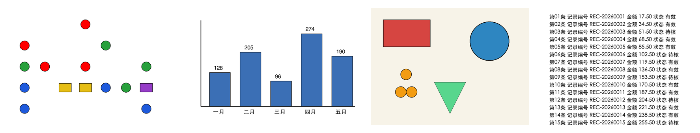
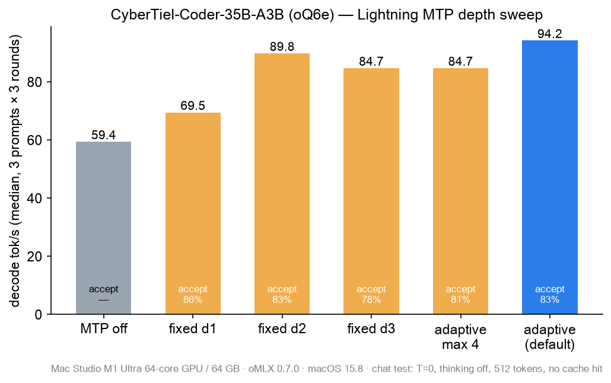
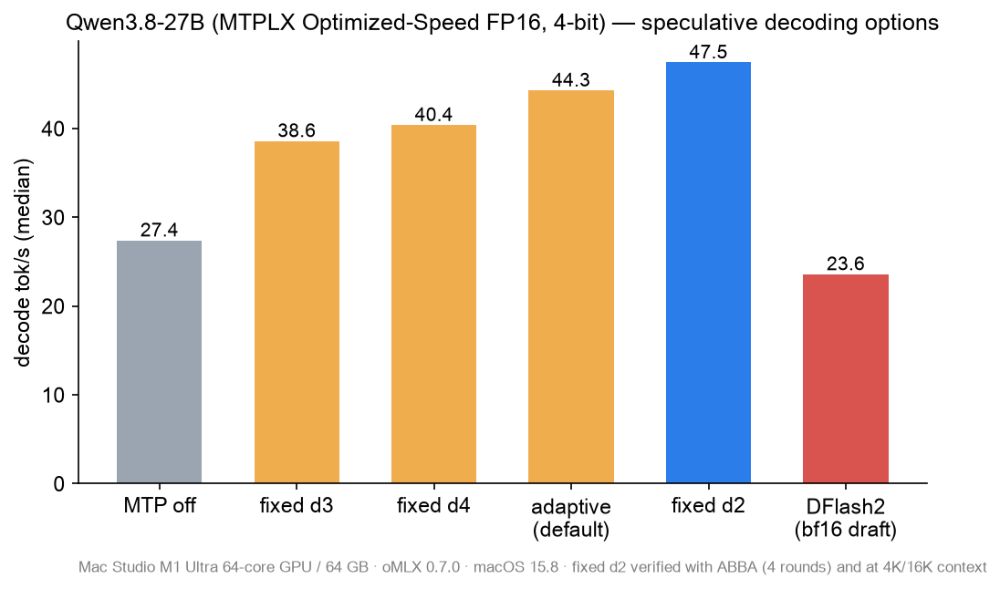
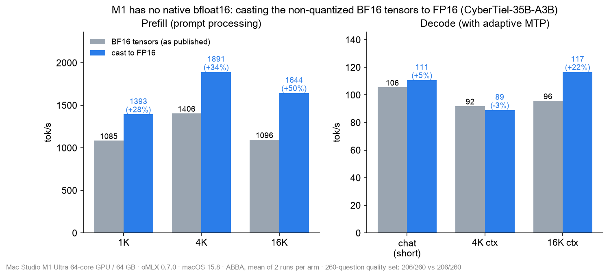
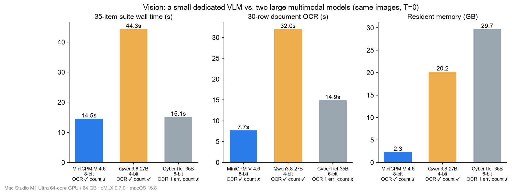
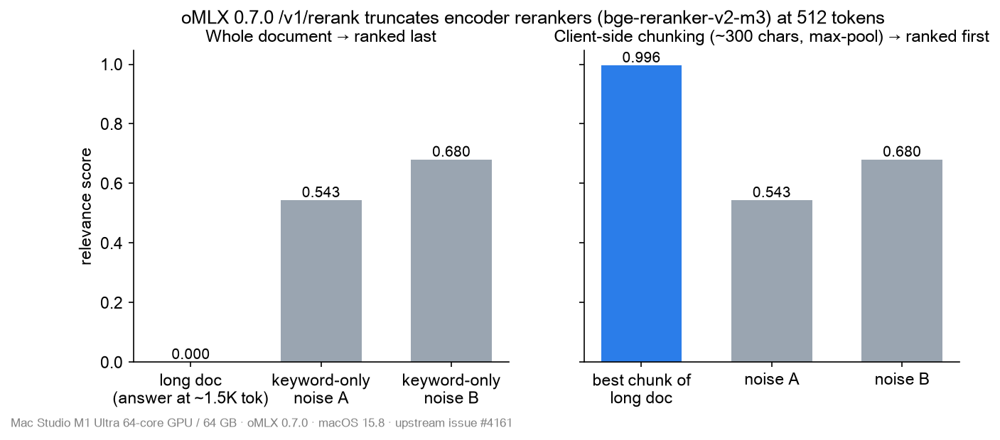
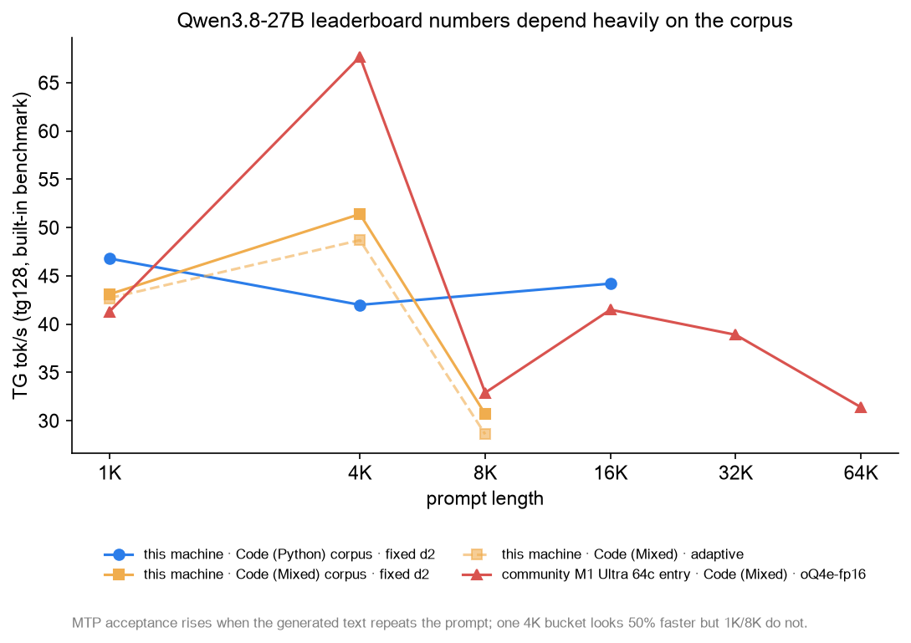
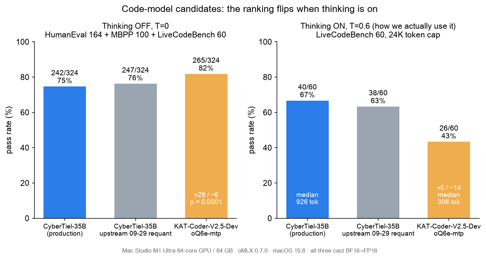

[English](README.md) | **简体中文**

# M1 Ultra 64 GB 跑 oMLX 0.7.0：五个本地模型的调优实测笔记

> 关键词：oMLX、MLX、Apple Silicon、M1 Ultra、Lightning MTP、投机解码、BF16→FP16、Qwen3.8-27B、
> CyberTiel-35B-A3B、MiniCPM-V-4.6、Reranker
>
> 测试时间：2026-10-06 ~ 10-07（10-07 下午追加第 10 节：社区热门代码模型候选实测）。所有数字都在同一台机器上实测，配置可以直接照抄复现。
> 文中的“社区数据”均注明了来源。



---

## TL;DR

| 模型 | 最终配置 | 实测效果（对比调优前） |
|---|---|---|
| **CyberTiel-Coder-35B-A3B**（oQ6e，MoE） | 把 BF16 浮点张量离线转成 **FP16** + **自适应 MTP 深度** | prefill **+28~50%**（16K：1096 → 1644 tok/s），16K 长上下文解码 **+22%**；对话口径 109–116 tok/s；260 题能力集 206 = 206 |
| **Qwen3.8-27B**（MTPLX Optimized-Speed FP16，4-bit） | **固定 MTP 深度 d2** | 对话口径 47–48 tok/s，较不开 MTP（27.4）**+73%**，较 0.7.0 默认自适应 **+7%** |
| **MiniCPM-V-4.6-8bit** | 不改，作为专职视觉模型保留 | OCR 与 27B 同为满分，**快 3–4 倍，内存只有约 1/9** |
| **Qwen3-Embedding-0.6B-8bit** | 不改（已是 FP16 张量） | — |
| **bge-reranker-v2-m3** | 不改；**客户端分块** | 修复 0.7.0 的 512 token 静默截断：答案在长文中部时，排名从末位回到第一 |

有 9 条经验值得分享，前三条收益最大（第 9 条是选型时最容易踩的坑）：

1. **M1/M2 没有硬件 BF16。** 把模型里没量化的 BF16 张量转成 FP16，prefill 能快 30–50%。只测短上下文解码会看不出来，我们第一次就因此误判过。
2. **升级 oMLX 0.7.0 之后，旧的 MTP 深度字段会静默失效。** 而且最优深度因模型而异，必须逐档测。
3. **社区榜单的 TG 数字高度依赖测试语料。** 同一模型同一台机器，4K 一档可以虚高 50%。
4. **评测代码模型必须用你实际的思考模式。** 社区热推的 KAT-Coder-V2.5 关思考时比我们的主力多对 23 题，开思考却少对 14 题。

---

## 1. 测试环境与口径

| 项目 | 值 |
|---|---|
| 硬件 | Mac Studio，M1 Ultra（20 核 CPU / **64 核 GPU**），**64 GB** 统一内存 |
| 系统 | macOS 15.8.1 |
| 推理服务 | **oMLX 0.7.0**（build 2987）；MLX 0.32.2、mlx-lm 0.31.4.dev、mlx-vlm 0.7.1 |
| 内存守卫 | tier `balanced`，`soft_threshold 0.85`（见第 6 节） |

**测速口径**

- **对话口径**（贴近真实使用）：
  - 三类提示词：中文长解释、写 Python 模块、数学推理，各跑 3 轮。
  - `temperature=0`，关闭思考，输出 512 token。
  - 每个请求开头加唯一随机串，保证 `cached_tokens=0`。
  - 取服务端返回的 `generation_tokens_per_second` 中位数，不用客户端 SSE 计时（会被分块缓冲扭曲）。
- **内置基准口径**（与 omlx.ai 社区榜相同）：
  - 用 admin 的 `/admin/api/bench/start` 跑 pp1K/4K/16K + tg128，语料是 `code_python`。
  - **注意**：内置基准默认会把结果**自动上传**到 omlx.ai 社区榜。我们加了 `"align_prompt_to_ane": true`：prompt 变成 4097 token（只差 1 个，可忽略），服务端据此跳过上传，结果只留本地。
- **对照方法**：所有“采纳”结论都经过 **ABBA** 交替测试（A、B、B、A），并且在**同一时段**完成。不同日期的绝对值不能直接比较，同一台机器隔天也可能差 10%。
- **质量门禁**：
  - **260 题固定能力集**：MMLU 50、CMMLU 50、TruthfulQA 50、GSM8K 50、HumanEval 20、MBPP 30、LiveCodeBench 10。
  - 题目来自 oMLX 自带 eval 数据，按固定种子抽样，T=0。
  - 生成的代码只在 `sandbox-exec` 沙箱里执行。
- **视觉门禁**：
  - 35 项视觉套件：OCR、图表读数、计数、多图对比、形状场景。
  - 一张 30 行大图逐行转写，共 60 个字段。
  - 测试图全部是合成数据，不含真实个人信息。

---

## 2. 经验一：升级到 0.7.0 后，先检查 MTP 字段

oMLX 0.7.0 **废弃了 `mtp_num_draft_tokens`**，MTP 深度改由两个新字段控制：
- `mtp_fixed_depth`：固定深度。
- `mtp_adaptive_max_depth`：自适应深度的上限；两者都为空时，使用模型默认的自适应深度。

旧字段**不会报错，只是被忽略**。我们的文档里一直写着 "CyberTiel d2 / Qwen d3"，升级后其实都在跑自适应深度，直到重新测速才发现。

**做法**：每次升级 oMLX，先对照 `~/.omlx/model_settings.json` 检查字段有没有被废弃或改名，再重新扫一遍 MTP 深度。

---

## 3. 经验二：最优 MTP 深度因模型而异，必须逐档测

### CyberTiel-35B-A3B（MoE）：自适应最快



| 配置 | 中文 | 代码 | 推理 | 中位 | 接受率 |
|---|---:|---:|---:|---:|---:|
| MTP 关 | 59.4 | 59.7 | 59.3 | 59.4 | — |
| 固定 d1 | 65.9 | 69.5 | 76.1 | 69.5 | 86% |
| 固定 d2 | 77.1 | 90.1 | 92.4 | 89.8 | 83% |
| 固定 d3 | 68.4 | 86.0 | 90.2 | 84.7 | 78% |
| 自适应，上限 4 | 74.7 | 88.4 | 85.5 | 84.7 | 81% |
| **自适应（默认）** | 78–82 | 94–98 | 94–100 | **94.1 / 95.0 / 94.2** | 82–84% |

### Qwen3.8-27B（稠密）：固定 d2 最快，反而比默认自适应快



| 配置 | 中文 | 代码 | 推理 | 中位 |
|---|---:|---:|---:|---:|
| MTP 关 | 27.3 | 27.2 | 27.5 | 27.4 |
| 固定 d3 | 33.0 | 39.5 | 38.8 | 38.6 |
| 固定 d4 | 32.9 | 40.5 | 41.3 | 40.4 |
| 自适应（默认，3 轮） | 35–42 | 44–46 | 45–47 | 44.2 / 44.8 / 44.3 |
| **固定 d2（4 轮 ABBA）** | 43.6–44.3 | 47.2–48.7 | 47.5–48.7 | **47.2 / 47.2 / 48.2 / 47.7** |
| DFlash2（BF16 草稿模型） | 17.9 | 24.4 | 23.6 | 23.6 |

内置基准下 d2 同样领先（单位 tok/s）：

| 上下文 | 固定 d2 | 自适应 |
|---|---:|---:|
| 1K | 46.8 | — |
| 4K | 42.0 | 39.9 |
| 16K | 44.2 | 43.0 |

**为什么会这样？** 稠密 27B 每次 verify 的代价比 MoE（每 token 只激活 3B）高得多，在 M1 上深一层草稿的边际收益很快被 verify 成本吃掉。

另外两点：
- DFlash2 草稿模型在 M1 上只有 MTP d2 的一半速度，两次独立测试结论相同。
- 0.7.0 中 Qwen3.8-27B 的 `mtp_adaptive_max_depth` 不能低于 4，想要 d2 只能用 `mtp_fixed_depth`。

```json
"Qwen3.8-27B-MTPLX-Optimized-Speed-oMLX": { "mtp_enabled": true, "mtp_fixed_depth": 2 }
"CyberTiel-Coder-35B-MLX":                { "mtp_enabled": true }
```

---

## 4. 经验三（最大收益）：M1/M2 上把 BF16 张量转成 FP16

### 原理

量化模型的权重主体是打包好的整数（`U32`），但 scales、biases、norm、embedding、MTP 头、视觉塔等**非量化张量**通常以 **BF16** 发布。前向计算的激活精度跟随这些张量走。

**M1/M2 没有原生 bfloat16 运算单元**，Metal 只能软件模拟；FP16 却是原生支持的。这些 BF16 张量会拖慢每一次前向计算，而矩阵乘占比最大的 prefill 受影响最明显。

这个思路来自 oMLX 社区 PR [#3277](https://github.com/jundot/omlx/pull/3277)（尚未合入 0.7.0）。作者在 M1 Ultra 128 GB 上测 Qwen3.8-Flash-Next：prefill **+60%**，decode +5~14%。

### 我们的教训

10-06 我们已经给 CyberTiel 做过一次 FP16 转换，但**只测了短上下文、关闭 MTP 的纯解码**（58.0 vs 56.4–59.4），结论是“无收益”，于是否决了。
10-07 看到 #3277 后补测 prefill 和长上下文，结果完全不同：



**CyberTiel-35B-A3B**（转换 1569 个 BF16 张量，共 2.94 GB；ABBA，各跑 2 次取均值）：

| | BF16 原版 | FP16 转换后 | 变化 |
|---|---:|---:|---:|
| prefill 1K | 994 / 1176 | 1353 / 1434 | **+28%** |
| prefill 4K | 1410 / 1403 | 1842 / 1940 | **+34%** |
| prefill 16K | 1096 / 1097 | 1644 / 1643 | **+50%** |
| 16K 首字时间 | 14.9 s | 10.0 s | −33% |
| 16K 上下文解码 | 97.2 / 94.4 | 115.5 / 117.7 | **+22%** |
| 4K 上下文解码 | 92.5 / 91.5 | 87.4 / 90.7 | 持平（噪声内） |
| 对话口径解码（ABBA） | 102.5 / 108.7 | 109.1 / 112.3 | +5% |
| 260 题能力集 | 206/260 | 206/260 | 持平 |
| 显存占用峰值 | 32.5 / 34.7 / 35.6 GB | 相同 | 0 |

质量判定细节：
- BF16 原版自己重跑一次，代码类题目就有 4 题翻转，LiveCodeBench 5/10 → 3/10。这是开启 MTP 时 T=0 的已知不确定性，见上游 [#4089](https://github.com/jundot/omlx/issues/4089)。
- BF16 和 FP16 之间的差异小于这个噪声底，FP16 版两次重跑完全一致。判定：**无退化**。

### 什么时候没用？（同样实测过）

| 模型 / 部件 | BF16 体量 | 结果 | 原因判断 |
|---|---|---|---|
| Qwen3.8-27B 文本部分 | 0 | 不需要 | 该打包本来就是 FP16 张量（“-FP16”版） |
| Qwen3.8-27B 视觉塔 | 0.86 GB | 无变化 | 视觉编码不是瓶颈，耗时主要在解码 |
| MiniCPM-V-4.6-8bit | 1.87 GB | 整体只快约 3%：图像编码 −14%，解码 −2% | 小模型以解码为主；没达到 5% 的上线门槛 |
| bge-reranker-v2-m3（F32） | 2.12 GB | 速度相同，分数差 < 0.0002，只省 1 GB 内存 | 编码器重排序本身很快 |
| Qwen3-Embedding-0.6B-8bit | 0 | 不需要 | 已是 FP16 |

**结论**：收益集中在**大模型 + 长 prompt** 的场景，例如代码 agent 和长文档。

### 怎么做（离线转换，不改 oMLX）

```python
# to_fp16.py <src> <dst>  —— 源目录只读；只改写含 BF16 张量的分片，其他文件用 APFS 克隆（cp -c，不占空间）
import sys, os, json, struct, subprocess
import mlx.core as mx
src, dst = sys.argv[1], sys.argv[2]; os.makedirs(dst, exist_ok=True)
for f in sorted(os.listdir(src)):
    sp, dp = os.path.join(src, f), os.path.join(dst, f)
    if os.path.isdir(sp) or f.startswith("."): continue
    hdr = {}
    if f.endswith(".safetensors"):
        with open(sp, "rb") as fh:
            n = struct.unpack("<Q", fh.read(8))[0]; hdr = json.loads(fh.read(n))
    if not any(isinstance(v, dict) and v.get("dtype") == "BF16" for v in hdr.values()):
        subprocess.run(["cp", "-c", sp, dp], check=True); continue
    ws, out = mx.load(sp), {}
    for k, v in ws.items():
        if v.dtype == mx.bfloat16:
            m = mx.max(mx.abs(v.astype(mx.float32))).item()
            assert m <= 65504, f"{k} 超出 FP16 范围 ({m})"   # 越界即中止
            v = v.astype(mx.float16)
        out[k] = v
    mx.eval(out); mx.save_safetensors(dp, out, metadata=hdr.get("__metadata__") or {})
# 最后把 config.json（含 text_config / vision_config）里的 "dtype"/"torch_dtype": "bfloat16" 改为 "float16"
```

CyberTiel 的转换报告：
- 最大绝对值 25.4，远小于 FP16 上限 65504。
- 26103 个极小值下溢为 0（占 BF16 元素的极小比例）。
- `model.safetensors.index.json` 不需要改。

**上线注意**：
1. 先放进隔离目录测 prefill、长上下文解码和能力集，过关后再替换。
2. 替换后**按 model_name 清掉旧的 SSD KV 缓存**（包括 GDN sidecar），否则会命中 BF16 时代的缓存块。
3. 把 BF16 原版留作回滚。
4. 上游 PR 合入后可以改用运行时开关，不再需要离线转换。

---

## 5. 经验四：专职小视觉模型 + 大模型分工

CyberTiel 和 Qwen3.8 都是多模态模型。MiniCPM-V-4.6 还有必要保留吗？三个模型跑同一套题：



| 指标 | MiniCPM-V-4.6 8-bit | Qwen3.8-27B | CyberTiel-35B |
|---|---:|---:|---:|
| 35 项套件 | 35/35 | 35/35 | 33/35 |
| 计数题（严格 JSON 复核） | ❌ 会陷入重复计数 | ✅ | ❌ |
| OCR：密集票据 / 小字 / 图表 / 30 行大图 60 字段 | 全对 | 全对 | 读错一个电话号码 |
| 套件总耗时 | **14.5 s** | 44.3 s | 15.1 s |
| 30 行大图转写 | **7.7 s** | 32.0 s | 14.9 s |
| 解码速度 | **~180 tok/s** | ~52 tok/s | ~85 tok/s |
| 常驻内存 | **~2.3 GB** | ~20.2 GB | ~29.7 GB |

**路由建议**：

| 任务 | 模型 |
|---|---|
| OCR、票据、图表读数、看图描述、多图对比 | MiniCPM-V |
| 计数、空间关系推理、需要思考的视觉任务 | Qwen3.8-27B |
| 对话中顺手看一眼图 | CyberTiel（不用于需要精确数字的场景） |

---

## 6. 经验五：内存守卫的遗留参数会让模型互相驱逐

`settings.json` 里的 `memory.soft_threshold` 在 0.7.0 中的含义是：
- **只有等于 0.85 时**才表示“不覆盖、交给档位管理”（`balanced` 档实际是 0.90）。
- 其他任何值都被当成**显式覆盖**。

我们在 0.6.x 时代手工设成了 0.70，带来两个问题：
- 准入软目标只剩约 29 GB，连默认的 CyberTiel（30 GB）自己都超标。
- 一调用视觉或重排序模型，就会把默认模型挤出内存，切回来要重新加载约 10 s。

改回 0.85 之后，CyberTiel、MiniCPM、Reranker、Embedding 四个模型（共 34.8 GB）可以同时常驻，切换只要 0.1–0.3 s，swap 没有增长。Qwen3.8 加载时仍会正确地与 CyberTiel 互斥。

---

## 7. 经验六：不要让其他引擎直接加载生产模型目录

09-21 我们用另一个 MLX 引擎直接加载了 Qwen3.8 的生产目录做对比，它**改写了 `model.safetensors.index.json`**，丢掉了：
- 31 个 `mtp.*` 条目（当时发现并补回了）；
- **333 个 `vision_tower.*` 条目**（当时没发现）。

0.7.0 按 index 加载权重，于是视觉塔被静默禁用。图像请求返回 500（`'NoneType' object has no attribute 'patch_embed'`），这个问题持续了两周才被发现。

**修复**：读取每个分片的 safetensors 头，重建 index。权重文件一个字节都不用动。

**预防**：
- 需要对照测试时，先用 `cp -c` 做 APFS 克隆，再交给其他引擎。
- 测完核对生产目录 index 的哈希，以及条目数是否和分片头一致。

```python
# 核对：index 条目数应等于所有分片头里的张量总数
import json, struct, glob
idx = json.load(open("model.safetensors.index.json"))["weight_map"]
n = 0
for f in glob.glob("*.safetensors"):
    with open(f, "rb") as fh:
        h = json.loads(fh.read(struct.unpack("<Q", fh.read(8))[0])); n += len(h) - ("__metadata__" in h)
print(len(idx), n)   # 两者必须相等
```

---

## 8. 经验七：0.7.0 的 Reranker 会把长文档静默截断到 512 token

`/v1/rerank` 遇到编码器类重排序模型（如 bge-reranker-v2-m3，模型本身支持 8192）时：
- 每个 query-文档对都按 **512 token** 截断；
- 请求体里的 `max_length` 和模型设置都不起作用（上游 [#4161](https://github.com/jundot/omlx/issues/4161)）。

我们构造了一个约 3K token 的长文，把真正的答案放在中部，再放两个只含关键词的短干扰文：



| | 长文 | 干扰 A | 干扰 B | 长文排名 |
|---|---:|---:|---:|---:|
| 整篇送入 | **0.000** | 0.543 | 0.680 | 第 3（末位） |
| 客户端按约 300 字切块，取最大分 | **0.996** | 0.543 | 0.680 | **第 1** |

**对策**：在客户端按段落或约 300 字切块（相邻块留重叠），每篇文档取各块的最高分。在上游修复之前，这是唯一可靠的办法。

---

## 9. 经验八：社区榜单的数字要看语料

omlx.ai 社区榜上，另一台同为 M1 Ultra 64 核 GPU / 64 GB 的机器跑 Qwen3.8-27B，4K TG 能到 66–72 tok/s，是我们的 1.6 倍。
详情页显示他们用的是 **Code (Mixed)** 语料，而且同一会话里各档差异巨大：

| 上下文 | 社区那台机器的 TG（tok/s） |
|---|---:|
| 1K | 41 |
| **4K** | **68** |
| 8K | 33 |
| 16K | 42 |

我们用同一语料复测（不上传）：



| 本机 Qwen3.8-27B | 1K | 4K | 8K | 16K |
|---|---:|---:|---:|---:|
| Code (Python)，d2 | 46.8 | 42.0 | — | 44.2 |
| Code (Mixed)，d2 | 43.1 | **51.4** | 30.7 | — |
| Code (Mixed)，自适应 | 42.7 | 48.7 | 28.6 | — |

**结论**：
- Code (Mixed) 的 4K 那段文本很容易被 MTP 猜中（续写内容和 prompt 高度重复），所以 4K 一档普遍虚高。1K 和 8K 两档就没有这个现象。
- 换成这个语料后，d2 仍然胜过自适应，不需要改配置。
- **看榜单时，先看语料和同一会话的各档曲线，别只看最高的那一格。**

其他社区数据对照（同为 M1 Ultra 64 核 GPU，omlx.ai，2026-10）：

| 模型 | 来源 | 4K PP | 4K TG | 16K PP | 16K TG |
|---|---|---:|---:|---:|---:|
| Cyber-Tiel-35B-A3B **oQ4e**-MTP | 社区，128 GB | 1219 | 73.6 | 1144 | 92.0 |
| CyberTiel-35B-A3B **oQ6e**，BF16 原版 | 本机 | 1406 | 92 | 1096 | 96 |
| CyberTiel-35B-A3B **oQ6e**，FP16 转换 | 本机 | **1891** | 89 | **1644** | **117** |

我们的 6-bit 版本更大，转成 FP16 后反而全面快于社区的 4-bit 版本。

---

## 10. 经验九：评测代码模型，必须用你实际使用的思考模式

10-07 下午我们复查了 oMLX 讨论区和 Hugging Face 趋势榜，挑了两个与主力 CyberTiel 同架构（Qwen3.6-35B-A3B MoE）、
体积相同（oQ6e 约 28 GB）的候选。两者都先按第 4 节转成 FP16，再与生产版同时段对比：

- **CyberTiel 上游 09-29 重量化版**：作者换了代码 + 安全加权的校准语料，472 个量化张量里有 461 个变了。
- **KAT-Coder-V2.5-Dev-VL-oQ6e-mtp**：讨论区有人推荐；快手官方 SWE-bench Verified 69.4，带护栏。



| 测试 | 生产 CyberTiel | 上游 09-29 重量化 | KAT-Coder-V2.5 |
|---|---:|---:|---:|
| 代码 324 题，关思考，T=0（HumanEval 164 / MBPP 100 / LCB 60） | 242（重跑 240） | 247 | **265**（+29/−6，p=0.0001） |
| 通用 260 题门禁 | 205 | 206 | 212 |
| **LiveCodeBench 60，开思考，T=0.6**（我们实际的用法） | **40** | 38 | **26**（0 胜 14 负） |
| 开思考回答长度中位数 | 926 token | 902 token | 306 token |
| 速度（prefill 4K / 16K，对话口径） | 1910 / 1620，77–92 | — | 1917 / 1620，91–92 |

结论：

- **KAT 关思考写短代码确实更强**，但它经过 RL 训练，思考非常短。到了需要长推理的算法题上，反而明显输给 CyberTiel。如果只跑关思考的 HumanEval/MBPP，就会得出完全相反的选型结论。
- **上游重量化版**三项测试都在噪声内（同一配置重跑，324 题会相差 2 题），思考 token 反而多了 27%。模型卡上的提升来自 GGUF + SWE-bench-Live，在 MLX 口径下没有复现。
- 两者速度一致（同架构、同量化）。所以这次不换模型。

> 方法提示：长时间压测后，SSD 缓存会涨到上限，几个 28 GB 模型轮换也会拖慢整机。我们测试时段的对话速度掉到 77–92 tok/s，重启并清理缓存后回到 112 tok/s。跨模型对比只看同时段 ABBA 数据。

---

## 11. 试过但否决的方案

| 方案 | 结论 | 依据 |
|---|---|---|
| DFlash2 投机解码（Qwen3.8） | ❌ | 23.6 tok/s，只有 MTP d2 的一半；两次独立测试结论一致 |
| MTPLX 2.12.2 原生引擎 | ❌ | M1 Ultra 上开不开 MTP 都输出乱码。另一位 M1 Ultra 用户的博客也显示：调优器宣称 25 tok/s，实际服务只有 16.5 tok/s |
| 官方 `Qwen3.8-27B-oQ4e-fp16-mtp` 替代 | ❌ | 同口径下打平，中文慢 8–10% |
| Qwen INT8 激活 prefill（oQ A8） | 不适用 | 只在 M5 及更新芯片（原生 INT8 张量运算）上生效；而且只支持 4/5-bit、group size 64 |
| ANE prefill（Qwen3.8） | 不适用 | 要求 group size 为 64 或 128，我们用的 Qwen 打包是 gs32。CyberTiel 在 0.6.x 实测“生效但无增益” |
| 空闲 2 s 后首次前向变慢约 900 ms（上游 #4040） | 本机未复现 | CyberTiel 空闲 0.3 s 到 15 s，首字时间都在 0.38–0.52 s，无需 `sudo sysctl iogpu.wired_limit_mb` |
| Qwen3.8-Flash-Next（180B MoE） | ❌ | 4-bit 就要 105 GiB，64 GB 装不下 |
| MiniCPM / Reranker / Qwen 视觉塔转 FP16 | ❌ | 见第 4 节，收益低于 5% 的门槛 |
| CyberTiel 上游 09-29 重量化版 | ❌ | 见第 10 节：三项能力测试都在噪声内 |
| KAT-Coder-V2.5-Dev oQ6e-mtp | ❌（生产口径） | 见第 10 节：关思考 +23 题，开思考 −14 题 |

---

## 12. 最终配置（照抄即可）

```jsonc
// ~/.omlx/model_settings.json（节选；建议通过 admin API 或 GUI 修改，不要在服务运行时手改文件）
"CyberTiel-Coder-35B-MLX": {            // 权重已离线转换为 FP16 张量
  "temperature": 0.6, "top_p": 0.95, "top_k": 20,
  "enable_thinking": true, "mtp_enabled": true,   // 自适应深度（两个深度字段都留空）
  "max_context_window": 131072, "max_tokens": 32768, "ttl_seconds": 1800, "is_default": true
},
"Qwen3.8-27B-MTPLX-Optimized-Speed-oMLX": {
  "mtp_enabled": true, "mtp_fixed_depth": 2,
  "thinking_budget_enabled": true, "thinking_budget_tokens": 16384,
  "max_context_window": 131072, "max_tokens": 32768, "ttl_seconds": 600
},
"MiniCPM-V-4.6-8bit": { "temperature": 0.0, "top_p": 1.0, "max_context_window": 65536, "ttl_seconds": 600 },
"Qwen3-Embedding-0.6B-8bit": { "is_pinned": true },
"bge-reranker-v2-m3": { "ttl_seconds": 3600 }
```

```jsonc
// ~/.omlx/settings.json（节选）
"memory": { "memory_guard_tier": "balanced", "soft_threshold": 0.85, "hard_threshold": 0.95 }   // 0.85 = 交给档位管理
"scheduler": { "max_concurrent_requests": 4, "chunked_prefill": true }
```

---

## 13. 注意事项

- **开启 MTP 后，T=0 的输出不保证逐字一致**（上游 #4089）。做质量对比时先测出噪声底，例如同一配置重跑一次。
- **内置基准会自动上传到 omlx.ai**，上传内容包括芯片、内存、模型名、模型设置和成绩。不想公开可以加 `align_prompt_to_ane: true`；或者在 GUI 里确认上传选项。
- **CyberTiel 是 abliterated（去除拒答）模型**，请只在 OS 级沙箱里使用，限制网络与执行权限，并防范提示注入。
- 0.7.0 的 macOS 15 安装包缺少 `chat.html`，`/admin/chat` 页面会报 500，但不影响 API。
- GUI 保存设置会卸载全部模型并中断进行中的请求。改配置优先走 admin API：`PUT /admin/api/models/{id}/settings`。

---

## 参考

- oMLX 0.7.0 Release：<https://github.com/jundot/omlx/releases/tag/v0.7.0>
- PR #3277：M1/M2 上使用 float16 激活：<https://github.com/jundot/omlx/pull/3277>
- Issue #4161：rerank 512 截断：<https://github.com/jundot/omlx/issues/4161>
- Issue #4089：MTP 下贪心解码非确定：<https://github.com/jundot/omlx/issues/4089>
- Issue #4040：空闲后首次前向停顿：<https://github.com/jundot/omlx/issues/4040>
- omlx.ai 社区榜：<https://omlx.ai/benchmarks>
- MTPLX on M1 Ultra（第三方博客）：<https://rbeckner.com/articles/mtplx-m1-ultra-serving-reality/>
- 模型：
  - [Cyber-Tiel-Coder-35B-A3B-MLX-oQ6e-MTP](https://huggingface.co/peculiar-ragdoll/Cyber-Tiel-Coder-35B-A3B-MLX-oQ6e-MTP)
  - [Qwen3.8-27B-MTPLX-Optimized-Speed-FP16](https://huggingface.co/Youssofal/Qwen3.8-27B-MTPLX-Optimized-Speed-FP16)
  - [MiniCPM-V-4.6-8bit](https://huggingface.co/mlx-community/MiniCPM-V-4.6-8bit)
  - [Qwen3-Embedding-0.6B-8bit](https://huggingface.co/mlx-community/Qwen3-Embedding-0.6B-8bit)
  - [bge-reranker-v2-m3](https://huggingface.co/BAAI/bge-reranker-v2-m3)


## 数据、脚本与许可

- `data/2026-10-06/`：MTP 深度扫描。`summary.jsonl` 是各配置的中位数，`results.jsonl` 是逐请求结果，`builtin.jsonl` 是内置基准，`vision_compare.jsonl` 是三模型视觉对比。
- `data/2026-10-07/`：第二轮测试数据。
  - FP16 转换的 ABBA 测速：`builtin.jsonl`、`summary.jsonl`。
  - 260 题能力集：`q260-*.jsonl`（逐题结果）、`q260-summary.jsonl`（汇总）。
  - 视觉 ABBA：`vision_compare.jsonl`。
  - Reranker 截断测试：`rerank.jsonl`。
  - 空闲后首字延迟：`idle_ttft.jsonl`。
  - 转换报告：`fp16-*.json`。
- `data/2026-10-07-candidates/`（第 10 节）：代码 324 题（`q260-code324-*`）、260 题门禁（`q260-g260-*`）、开思考 LiveCodeBench 60（`q260-lcb60think-*`）逐题结果；同时段测速 ABBA：`builtin.jsonl`、`results.jsonl`、`summary.jsonl`。
- `scripts/to_fp16.py`：离线 BF16→FP16 转换脚本。只改写含 BF16 张量的分片，其余文件用 APFS 克隆。用法：`python to_fp16.py <源模型目录> <输出目录> [--f32]`。
- 许可：文字、图表与数据采用 CC BY 4.0；脚本采用 MIT。测试图全部为合成数据，不含任何个人信息。

*欢迎拿你的机器复现并回帖交流。M1/M2 用户尤其建议试一下第 4 节的 FP16 转换。*
